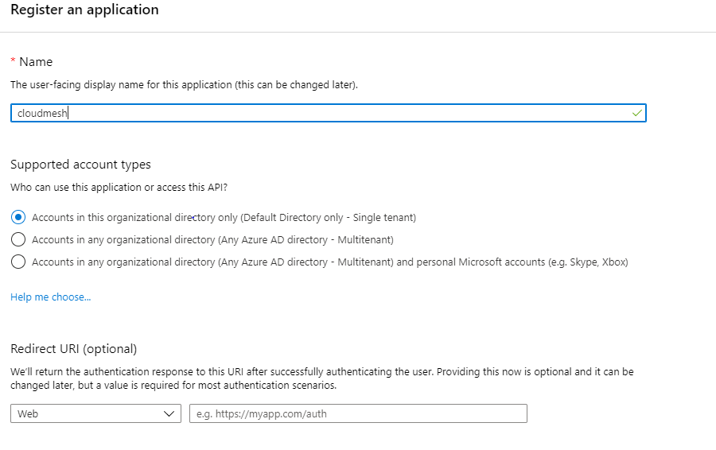
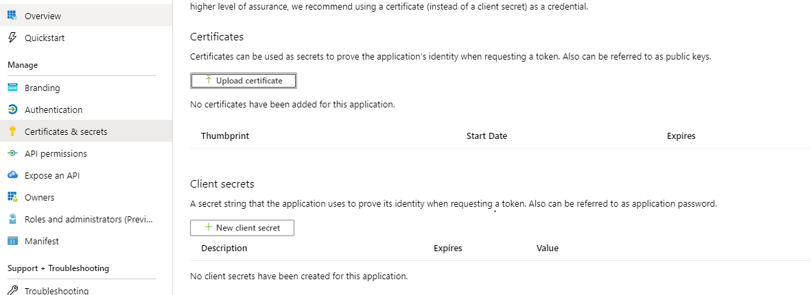
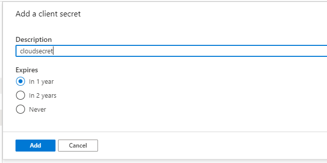
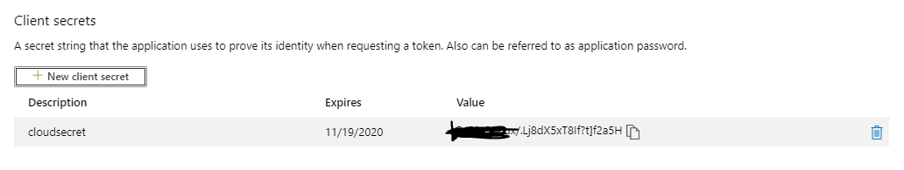

#### Azure_Subscription_ID
Navigate to subscriptions

Copy the Subscription ID to notepad

#### Azure_Tenant_ID & Azure_Client_ID
Navigate to "Azure Active Directory" service and select "App Registrations".
Then select "New Registration"

You can input any name for the application

After creation, you will be navigated to the overview page of the application, on this page copy the client ID and tenant ID to notepad

#### Azure_Secret_Key
In the same application page, navigate to Certificates & secrets and select "New client secret"

You can give any meaningful name to the new secret, use the default expiration for security purpose

 After creation, copy the new client secret to notepad
 
 
#### Grant permission to applicaiton
After we have collected 4 credentials, 
we need to add a role assignment to the application that we just created, 
so it can access the resources

Navigate to the subscription overview page and select "Access control(IAM)"
then select "add", "Add role assignment"

You can give the application "Contributor" role,
the "contributor" role has enough access for compute resources. 
Leave the second option as "Azure AD user, group, or service principal".
For third option, you need to input the application name that you just created,
it doesn't show up by default

#### Add the credentials to cloudmesh.yaml
Now we need to open cloudmesh.yaml and add the 4 credentials
that we just collected to the "azure" section of cloudmesh.yaml

