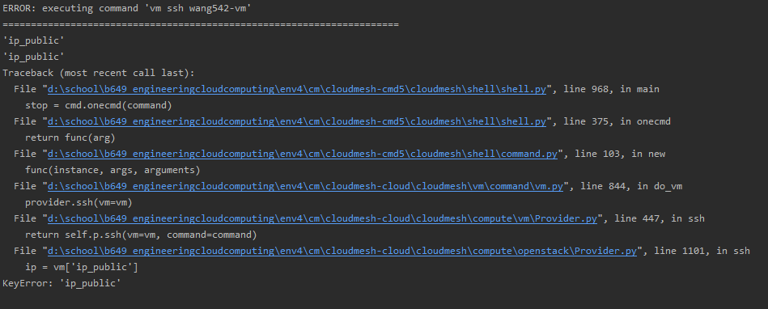

# Benchmark Compute Providers

Chenxu Wang, fa19-516-157

- [fa19-516-157](https://github.com/cloudmesh-community/fa19-516-157)

- [Link to custom benchmark script](https://github.com/cloudmesh-community/fa19-516-157/blob/master/compute_BenchMarker.py)

- [Link to custom benchmark output](https://raw.githubusercontent.com/cloudmesh-community/fa19-516-157/master/benchmarkOutput_v2.txt)

## Goal

- Benchmark the current cloudmesh compute commands on different providers 

### Result

## Insights

- aws is the most efficient out of 3 providers, as expected

- azure is really fast in retrieving flavor and image list compared to aws

- azure takes long time to boot vm compared to aws because azure has to create 
all resources one by one where aws has default resources ready, and the azure api has long poller structure.

- same as previous point, azure terminate takes long time because the provider will delete every resource 
related to the terminating vm, which is a potential bug if two vm share same resources.

## Discoveries

- ssh error, seems to be a mongodb key lookup error when looking for publicIP, but there are users
stated that ssh works for them

- Update ssh error(Week of December 8)

  - The public_ip look up error has been resolved and vm ssh is working on azure, but aws still
    seems to encounter error "connection refused by remote", possibly due to secrule

- Chameleon:

    - booting multiple vms will definitely fail because sometimes chameleon takes long time
     to boot 1 vm (longest I've encountered is 11 minutes) and provider will time out 

    - user will encounter problem if he try to start vm immediately after stop vm, or vice versa
    chameleon takes longer time to process the vm actions 

- AWS:
    
    - cms image list --refresh will encounter error, the correct results are retrieved successfully
    from aws, the results are stored in temp file in .cloudmesh and is correct.
    
    
 
    The error is likely with the mongodb operations in aws provider
    
    - vm terminate outputs error but it actually works, it is likely the flatdict function encountered
    empty dictionary when trying to display result
 
 - Azure:
    
    - user need to use command `cms set key=keyname` & `cms key init` before using azure as cloud,
    `cms init` doesn't include `key init`.
    
    - vm terminate in azure provider should be restructured to terminate the vm only, currently terminate
    will delete all resource related to vm, if two vm share same resources such as NIC, SecGroup then terminate
    can cause error.
    
    - cms image list --refresh doesn't seem to be displaying the correct images, the displayed images
    doesn't seem to be official images like Ubuntu, Centos, following table is the azure image output
    
    - Update: After further investigation and discussing with TA, the image list is getting retrieved
    , It is just displaying first few images of the entire output.
    

    | Name    | Location | Publisher     | Plan Name                | Product                  | Operating System |
    |---------|----------|---------------|--------------------------|--------------------------|------------------|
    | 1.0.0   | eastus   | 128technology | 128t_networking_platform | 128t_networking_platform |                  |
    | 1.1.0   | eastus   | 128technology | 128t_networking_platform | 128t_networking_platform |                  |
    | 1.1.2   | eastus   | 128technology | 128t_networking_platform | 128t_networking_platform |                  |
    | 4.10.11 | eastus   | 1e            | tachyonv4-1              | tachyonv30-0-100         |                  |
    | 0.0.2   | eastus   | 2021ai        | grace_vm                 | grace-churn-vm           |                  |
    | 16.0.8  | eastus   | 3cx-pbx       | 16                       | 3cx-pbx                  |                  |
    | 5.2.5   | eastus   | 4psa          | vpn525-single            | voipnow                  |                  |
    ---------------------------------------------------------------------------------------------------------------

### How to Use This Custom Benchmark Script

- Before using this script, users need to complete the initial cloudmesh setup process, 
including `cms init`, `cms key init`, and upload public key onto cloud 
providers. Note, azure doesn't support key storage.

- Adjust the cloud_providers list in line 19 of compute_BenchMarker.py, 
if there are more cloud providers implemented in cloudmesh.

- To run the script, simply type `python compute_BenchMarker.py`in a terminal under 
same directory as the script.
    
## Progress

### Week 8 October 14

- Implemented a script using azure python libraries to start compute service without cloudmesh

- Found the methods needed to create security group in azure package

- Successfully created security group when creating vm 

- [Link to Azure practice script](https://github.com/cloudmesh-community/fa19-516-157/blob/master/project/AzurePractice/myAzurePractice.py)

### Week 9 October 21

- Attached Network Security Group when creating VM

- [Link to Azure practice script](https://github.com/cloudmesh-community/fa19-516-157/blob/master/project/AzurePractice/myAzurePractice.py)

### Week 10 October 28

- Started working in cloudmesh-compute-azure, added network secGroup attachment

- [Link to forked cloudmesh-compute repo](https://github.com/wang542/cloudmesh-cloud/blob/azure_wang542/cloudmesh/compute/azure/Provider.py)

### Week 11 November 4

- Added key attachment during vm creation

- Solved error within local env, had to reinstall cloudmesh

- [Link to forked cloudmesh-compute repo](https://github.com/wang542/cloudmesh-cloud/blob/azure_wang542/cloudmesh/compute/azure/Provider.py)

### Week 12 November 11

- added ssh function in azure provider

- restructured local repo to work directly in environment

- [Link to forked cloudmesh-compute repo](https://github.com/wang542/cloudmesh-cloud/blob/azure_wang542/cloudmesh/compute/azure/Provider.py)

### Week 13 November 18

- The provider was finished by TA, changing to benchmark compute providers

- Solved a minor bug in cms vm start

- Wrote a script that will run compute commands through different clouds
[Link to benchmark script](https://github.com/cloudmesh-community/fa19-516-157/blob/master/compute_BenchMarker.py)

- Documented instructions on how to generate important credentials for azure API
[Link to credential instruction](https://github.com/cloudmesh-community/fa19-516-157/blob/master/azure_credentials.md)

### Week 15 December 2

- Benchmarked cloudmesh with cloudmesh tests

- [Link to 1-local-wang542](https://github.com/wang542/benchmark/blob/wang542/results/1_local-wang542.md)

- [Link to cloud-aws-wang542](https://github.com/wang542/benchmark/blob/wang542/results/cloud-aws-wang542.md)

- [Link to cloud-openstack-wang542](https://github.com/wang542/benchmark/blob/wang542/results/cloud-openstack-wang542.md)

- [Link to cloud-azure-wang542](https://github.com/wang542/benchmark/blob/wang542/results/cloud-azure-wang542.md)

- [Link to complete output of benchmarkers](https://github.com/cloudmesh-community/fa19-516-157/tree/master/Benchmark_Output)

### Week 16 December 8

- Tested updated compute with custom script

- Benchmarked updated cloudmesh with cloudmesh tests

- [Link to cloud-aws-wang542-v2](https://github.com/wang542/benchmark/blob/wang542/results/cloud-aws-wang542-v2.txt)

- [Link to cloud-azure-wang542-v2](https://github.com/wang542/benchmark/blob/wang542/results/cloud-azure-wang542-v2.txt)

- [Link to cloud-openstack-wang542-v2](https://github.com/wang542/benchmark/blob/wang542/results/cloud-openstack-wang542-v2.txt)

## Reference

- [Create VM on Azure using Python](https://docs.microsoft.com/en-us/azure/virtual-machines/windows/python#)

- [Issue/Example related to NSG creation on github-azure](https://github.com/MicrosoftDocs/azure-docs/issues/30555)

- [Discussion regarding NSG security rules](https://stackoverflow.com/questions/55970074/issues-with-network-security-group-deployment-using-python-networksecuritygrou)

- [Azure documentation-Security Group](https://docs.microsoft.com/en-us/azure/virtual-network/security-overview)

- [Azure Security Rules Operation class -python](https://docs.microsoft.com/en-us/python/api/azure-mgmt-network/azure.mgmt.network.v2017_03_01.operations.securityrulesoperations?view=azure-python)
